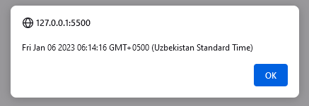
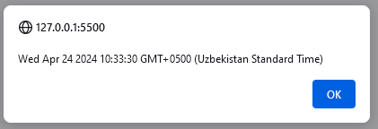
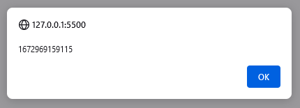
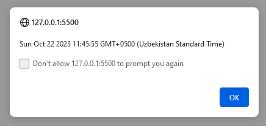
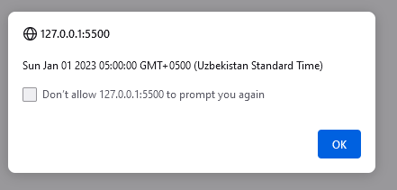
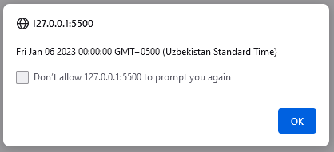
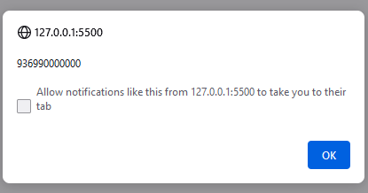
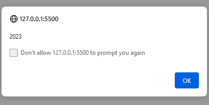
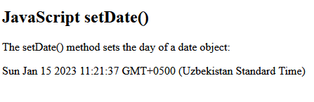

# Date-Javascript

 

     The Date object in JavaScript is predefined data type. This Date object is used to get the 
     
     dates and times. We can create Date object by using new keyword (newDate ()). The Date 
     
     object is used for date and time in milliseconds precision within a range of 100M (100 
     
     Millions) days before or after the date of 1 January 1970. By using separate methods, we 
     
     can get and set the year or month or day or hour or minute or second or millisecond in UTC 
     
     or GMT time format. We can declare date object in 4 ways.
     
     Create Date Object in JavaScript.

         --- new Date(): It gives present date and time.

         --- new Date(yyyy, MMM, dd, hh, mm, ss, ms): It gives you date with Year(yyyy), Month
         
         (MMM), day(dd), hours(hh), minutes(mm), seconds(ss) and milliseconds(ms) respectively.

         --- new Date(ms): It gives you date with milliseconds.

         ---new Date(“Date as String”): It gives you date as String.
 
#### JavaScript new Date()
 
      new Date() creates a date object with the current date and time:

      Example: let date = new Date();  alert(date);

 
      
      
#### new Date(year, month, ...)

     new Date(year, month, ...) creates a date object with a specified date and time.7 numbers 
     
     specify year, month, day, hour, minute, second, and millisecond (in that order):
     
     JavaScript counts months from 0 to 11:January = 0. December = 11.Specifying a month higher 
     
     than 11, will not result in an error but add the overflow to the next year:

     Note :

     Using 6, 4, 3, or 2 Numbers

         1.  6 numbers specify year, month, day, hour, minute, second:
         
         2.  5 numbers specify year, month, day, hour, and minute:
         
         3.  4 numbers specify year, month, day, and hour: 
         
         4.  and so on
         
         Example:
         
         let date = new Date(2023,15,24,10,33,30);   alert(date);

 

#### new Date(milliseconds)

     JavaScript stores dates as number of milliseconds since January 01, 1970.One day (24 
     
     hours) is 86 400 000 milliseconds.new Date(milliseconds) creates a new date object as 
     
     milliseconds plus zero time:
     
          Example:
         
         let date = new Date().getTime();  alert(date);

     

#### new Date(date string)

     new Date(date string) creates a date object from a date string:
     
     Example  :let date = new Date('October, 22,2023, 11:45:55');
            
              alert(date);

 

     There are generally 3 types of JavaScript date input formats:
         
         1.  ISO Date       	"2023-01-06" (The International Standard);
         
         2. Short Date          "03/25/2015"
        
         3.Long Date           	"Mar 25 2015" or "25 Mar 2015"

     ISO Dates

     ISO 8601 is the international standard for the representation of dates and times.The ISO 
     
     8601 syntax (YYYY-MM-DD) is also the preferred JavaScript date format:
         
         Example:let date = new Date('2023-01');  alert(date)

 

     Long Dates

     Long dates are most often written with a "MMM DD YYYY" syntax like this: Month and day can 
     
     be in any order. And, month can be written in full (January), or abbreviated (Jan): 
         
         Example: 
         
         let date = new Date('Jan,06, 2023');  alert(date);

 
    

     Parsing Dates

     If you have a valid date string, you can use the Date.parse() method to convert it to 
     
     milliseconds.Date.parse() returns the number of milliseconds between the date and January 
     
     1, 1970:
         
         example: let date = Date.parse('sep,11,1999');  alert(date);

 

##### Date Get Methods

     Method 	               Description
     
     getFullYear() 	           Get year as a four digit number (yyyy)
     
     getMonth() 	           Get month as a number (0-11)
     
     getDate() 	               Get day as a number (1-31)
     
     getDay()  	               Get weekday as a number (0-6)
     
     getHours() 	           Get hour (0-23)
     
     getMinutes() 	           Get minute (0-59)
     
     getSeconds() 	           Get second (0-59)
     
     getMilliseconds() 	       Get millisecond (0-999)
     
     getTime() 	              Get time (milliseconds since January 1, 1970)

     The get methods above return Local time.The get methods return information from existing 
     
     date objects.In a date object, the time is static. The "clock" is not "running".The time 
     
     in a date object is NOT the same as current time.
     
     If we wont to get getFullYear() method returns the year of a date as a four digit number:
         
         Example:let date = new Date();
         
         let year = date.getFullYear();  alert(year);

 

##### Set Date Methods
 
     Set Date methods let you set date values (years, months, days, hours, minutes, seconds, 
     
     milliseconds) for a Date Object.

         Method 	                Description
         
         setDate() 	                Set the day as a number (1-31)
         
         setFullYear() 	            Set the year (optionally month and day)
         
         setHours() 	            Set the hour (0-23)
         
         setMilliseconds() 	        Set the milliseconds (0-999)
         
         setMinutes() 	            Set the minutes (0-59)
         
         setMonth() 	            Set the month (0-11)
         
         setSeconds() 	            Set the seconds (0-59)
         
         setTime()        	        Set the time (milliseconds since January 1, 1970)

             Example: setMonth()

             const date = new Date();   alert(date.setDate(15));

 
